# Android camera, media & streaming primer

*Background reading for the design docs, not a design doc itself. Several `phone-*` component
descriptions — and the controller's live-preview one — are written against the Android
`Camera2`, `MediaCodec`, `MediaMuxer` / `MediaExtractor`, `SurfaceTexture` / OpenGL ES, and
MPEG-TS / HLS / hls.js APIs and assume the reader already knows them. This file introduces each
one for a generalist and points at where Panopticon uses it. It is deliberately shallow — just
enough vocabulary to read [`architecture.md`](architecture.md) §5.1 and the pipeline components
without a browser tab open on `developer.android.com`. Acronyms expand in
[`architecture.md` §1.4](architecture.md#14-acronyms-and-abbreviations); §"Further reading"
below has the authoritative sources.*

---

## 1. The one idea: a `Surface` is a buffer queue

Almost everything below is wired together with one Android primitive. A **`Surface`** is the
*producer* end of a queue of graphics buffers; something else holds the *consumer* end. A
producer fills a buffer and enqueues it; the consumer dequeues it, uses it, and returns it.
Neither side copies the pixels — the buffer is shared memory, often GPU memory — so the handoff
is cheap even at 1080p24.

What plugs into what:

| Producer (fills buffers) | Consumer (`Surface` belongs to) |
|---|---|
| the camera (Camera2 capture session) | a `SurfaceTexture`, a `MediaCodec` encoder, an `ImageReader`, an on-screen view |
| a GL renderer (via EGL) | a `MediaCodec` encoder input surface, a `SurfaceTexture`, the display |
| a `MediaCodec` **decoder** | a `SurfaceTexture`, an on-screen view |

So "Camera2 → `SurfaceTexture` → GL → `MediaCodec`" is three producer/consumer hops, no pixel
copies on the CPU. When a doc says a component "targets a surface" or "renders into the encoder's
input surface", this is the mechanism.

A **capture session** can target *several* surfaces at once (each is a "stream"): e.g. one
low-res stream to an `ImageReader` for analysis **and** one full-res stream to an encoder. The
camera HAL (§2) publishes which *combinations* it supports; weak HALs support very few. That
constraint is the reason the recording pipeline looks the way it does (§9,
[`decisions/0004-recording-pipeline.md`](decisions/0004-recording-pipeline.md)).

---

## 2. Camera2 — getting frames off the sensor

`android.hardware.camera2` is the low-level camera API (the old `android.hardware.Camera` is
deprecated; CameraX is a higher-level wrapper Panopticon does not use). The flow:

1. **`CameraManager`** — system service. `getCameraIdList()` returns camera ids (`"0"`, `"1"`, …);
   `getCameraCharacteristics(id)` returns a read-only **`CameraCharacteristics`** bag of what the
   camera *declares* — sensor size, supported resolutions, focal lengths, control ranges,
   hardware level. Panopticon's camera-control component is largely a structured read of this bag
   ([`components/phone-camera-control.md`](components/phone-camera-control.md)).
2. **`openCamera(id, …)`** → a **`CameraDevice`** (exclusive; only one app holds a camera).
3. **`createCaptureSession(SessionConfiguration)`** — hand it the list of output `Surface`s you
   want frames delivered to. The HAL validates the combination here; an unsupported combination
   fails now or, on buggy HALs, fails asynchronously a moment later
   ([`quirks/camera2-recording-pipeline.md`](../quirks/camera2-recording-pipeline.md)).
4. **`CaptureRequest`** — built from a template (`TEMPLATE_RECORD`, `TEMPLATE_PREVIEW`,
   `TEMPLATE_STILL_CAPTURE` — presets for sane defaults), with target surface(s) added and
   control keys set (exposure, focus, zoom, fps range, …).
   - `setRepeatingRequest(req)` — the camera keeps producing frames with these settings until
     you change them. This is "the repeating request" the docs mention; camera controls are
     applied by merging keys into it and re-submitting, **no session rebuild**.
   - `capture(req)` — a single frame (used by calibration for one-shot read-back).
5. **`CaptureResult`** / `TotalCaptureResult` — per-frame metadata delivered to a callback: what
   the HAL *actually* used (real exposure, real crop rect, active physical camera…). Calibration
   exists because this can disagree with both the request and the declared characteristics
   ([`components/phone-calibration.md`](components/phone-calibration.md)).

### Hardware level and why multi-stream configs fail

`INFO_SUPPORTED_HARDWARE_LEVEL` is one of `LEGACY < LIMITED < FULL < LEVEL_3` (plus `EXTERNAL`).
It caps *which surface combinations* a capture session can target and which manual controls
exist. A `LEGACY` device is roughly "the old `android.hardware.Camera` API in a Camera2 costume".
Panopticon's low-end test phone (BLU G5, Unisoc SC9863A) rejects a two-stream
`[analysis + video]` session outright — the single-stream GPU fan-out (§3, §9) is the
workaround.

### The 3A controls and manual override

"3A" = **AE** (auto-exposure), **AF** (auto-focus), **AWB** (auto-white-balance). By default the
HAL runs all three. Manual control means switching one to `OFF` and supplying the raw value:

| Auto knob off | You must then supply | Gated by capability |
|---|---|---|
| `CONTROL_AE_MODE = OFF` | `SENSOR_EXPOSURE_TIME` (ns) + `SENSOR_SENSITIVITY` (ISO) [+ `SENSOR_FRAME_DURATION`] | `MANUAL_SENSOR` |
| `CONTROL_AF_MODE = OFF` | `LENS_FOCUS_DISTANCE` (dioptres; 0 = infinity) | `MANUAL_SENSOR` / focus range |
| `CONTROL_AWB_MODE = OFF` | `COLOR_CORRECTION_GAINS` (an **RGGB** 4-tuple) **and** an identity `COLOR_CORRECTION_TRANSFORM` | `MANUAL_POST_PROCESSING` |

**Zoom** has two mutually-exclusive expressions: the legacy `SCALER_CROP_REGION` (a pixel
`Rect` inside `SENSOR_INFO_ACTIVE_ARRAY_SIZE` — a smaller rect = more zoom, and an off-centre
rect = a pan) and the newer `CONTROL_ZOOM_RATIO` (API 30+, a float ≥ 1.0). Never both in one
request. Whether the HAL *honours* an off-centre crop — moves actual pixels, versus just echoing
the rect back in metadata — is device-specific and is exactly what calibration probes
([`quirks/calibration-zoom.md`](../quirks/calibration-zoom.md)).

---

## 3. `SurfaceTexture` + OpenGL ES — the fan-out

### `SurfaceTexture`

A **`SurfaceTexture`** is a `Surface` (so the camera can target it) whose enqueued frames become
an **OpenGL ES texture** you can sample in a shader. It is how you get a camera frame *onto the
GPU* for processing.

- `setDefaultBufferSize(w, h)` — the buffer resolution the producer fills.
- `updateTexImage()` — bind the most-recent frame to the texture (called on the GL thread).
- `getTransformMatrix(float[16])` — a 4×4 matrix to apply to texture coordinates. It encodes
  whatever crop / flip / rotation the HAL applied, so the sampled image comes out upright and
  correctly framed. Ignoring it, or the HAL returning ≈ identity when you didn't expect it, is
  the root of the anamorphic-squash quirk
  ([`quirks/camera2-recording-pipeline.md`](../quirks/camera2-recording-pipeline.md)).
- The texture is not a normal 2D texture: it binds to `GL_TEXTURE_EXTERNAL_OES` and a fragment
  shader samples it via `samplerExternalOES` with `#extension GL_OES_EGL_image_external`. That is
  all "**OES**" means in these docs — the external-texture extension a `SurfaceTexture` feeds.

### Just enough OpenGL ES

OpenGL ES ("GLES") is the embedded subset of OpenGL. Panopticon's use is tiny — draw a
full-screen quad with the camera texture on it, maybe twice — but the vocabulary:

| Term | Meaning in this codebase |
|---|---|
| **EGL** | the glue between GLES and the OS windowing/`Surface` system. `EGLContext` holds GL state on the GL thread; `eglCreateWindowSurface(surface)` wraps a `Surface` (e.g. the encoder's input surface) so GL draws *into* it; `eglSwapBuffers()` enqueues the finished frame; `eglPresentationTimeANDROID()` stamps its timestamp (which becomes the encoded frame's PTS). |
| **shader** | a small GPU program. A **vertex shader** positions the quad's corners; a **fragment shader** computes each output pixel (here: sample the external texture). Written in GLSL. |
| **uniform** | a read-only input to a shader, set from the CPU once per draw call, the same for every vertex/pixel in that call (versus *attributes*, which vary per vertex). Panopticon's shaders take uniforms like `uSTMatrix` (the `SurfaceTexture` transform), `uTexCrop` (a centre-crop factor that fixes the >1080p aspect mismatch), and an MVP/vertex matrix. When a doc says "a `uTexCrop` shader uniform centre-crops to the output aspect", it means: a constant the CPU hands the shader each frame that scales the sampled texture region. |
| **FBO** (framebuffer object) | an off-screen render target backed by a texture. Panopticon renders a small downscaled copy of the frame to an FBO so it can read those pixels back cheaply. |
| **`glReadPixels`** | copy pixels from the bound framebuffer back to CPU memory. Slow — bytes cross the GPU/CPU boundary — so it is done on the *small* analysis FBO, never the full frame. The frame-difference motion detector runs on this read-back ([`components/phone-recording-pipeline.md`](components/phone-recording-pipeline.md)). |

**The fan-out**, then, is: one camera frame in the external texture, drawn twice on the GL
thread — once scaled down into an FBO (→ `glReadPixels` → motion), once at full size into the
EGL window surface that *is* the encoder's input (→ compressed video). One camera stream, two
consumers, all on the GPU.

---

## 4. `MediaCodec` — frames to a compressed bitstream

**`MediaCodec`** is the interface to the device's hardware (or software) video/audio codecs. For
recording, Panopticon uses it as an **H.264 encoder**:

- `createEncoderByType("video/avc")`, then `configure(format, …, CONFIGURE_FLAG_ENCODE)`.
- **`MediaFormat`** carries the config keys: `KEY_WIDTH`/`KEY_HEIGHT`, `KEY_BIT_RATE`,
  `KEY_FRAME_RATE`, `KEY_I_FRAME_INTERVAL` (seconds between keyframes; `1` = one per second),
  `KEY_COLOR_FORMAT = COLOR_FormatSurface` (input comes from a `Surface`, not byte buffers).
- **`createInputSurface()`** — instead of feeding raw pixels in byte buffers, you get a `Surface`
  and let GL (or the camera) render into it. This is the "encoder input surface" the pipeline
  docs mention.
- **Output** is pulled in a *drain loop*: `dequeueOutputBuffer()` hands you a buffer of
  compressed bytes plus a `BufferInfo` (`presentationTimeUs`, flags). Flags that matter:
  `BUFFER_FLAG_CODEC_CONFIG` (the SPS/PPS parameter sets — stream header, not a frame),
  `BUFFER_FLAG_KEY_FRAME` (this access unit is a keyframe), `BUFFER_FLAG_END_OF_STREAM`.
- **`setParameters(PARAMETER_KEY_REQUEST_SYNC_FRAME)`** — ask the encoder to emit a keyframe
  *now*, rather than waiting for the next `KEY_I_FRAME_INTERVAL` boundary. Panopticon uses this
  to land a keyframe at each segment boundary; how reliably a HAL honours it varies
  ([`quirks/camera2-recording-pipeline.md`](../quirks/camera2-recording-pipeline.md)).

Terms:

- **access unit (AU)** — the coded bytes for exactly one frame.
- **keyframe** / IDR / "sync frame" — an AU that decodes on its own, with no reference to earlier
  frames. A player (or a new recording segment, or an HLS segment) can only *start* at a
  keyframe, which is why every segment boundary is aligned to one.
- **PTS** (presentation timestamp) — when a frame should be shown. Muxers and players sort and
  schedule by PTS; Panopticon rebases PTS to zero at the start of each recording segment.
- **H.264 = AVC** — the codec. Its bytes come in two framings: **Annex-B** (AUs separated by
  `00 00 00 01` start codes — what `MediaCodec` emits and what MPEG-TS wants) and length-prefixed
  (what an `.mp4` stores). The live muxer works in Annex-B.

The phone has **one** hardware encoder. `record` and `live` are mutually exclusive partly for
this reason ([`decisions/0010-mode-state-machine.md`](decisions/0010-mode-state-machine.md)).

---

## 5. `MediaMuxer` / `MediaExtractor` / `ImageReader` — containers and read-back

A **codec** compresses frames; a **container** (a.k.a. muxer format) is the *file wrapper* that
interleaves one or more coded tracks with timing and an index. `.mp4` is a container; H.264 is
the codec inside it.

- **`MediaMuxer`** — writes a container. `new MediaMuxer(path, MUXER_OUTPUT_MPEG_4)`,
  `addTrack(format)` → track index, `start()`, then `writeSampleData(trackIndex, buffer,
  bufferInfo)` for each AU (the `bufferInfo.presentationTimeUs` is the sample's PTS), `stop()` /
  `release()`. Panopticon's recording pipeline keeps the *encoder* running continuously and
  opens/closes/swaps a `MediaMuxer` around it to gate and rotate segment files.
  **`MediaMuxer` supports only MP4 / WebM / 3GP / OGG — not MPEG-TS** — which is why the live
  path hand-rolls its own TS muxer (§6, [`quirks/mpeg-ts.md`](../quirks/mpeg-ts.md)).
- **`MediaExtractor`** — the reader counterpart: `setDataSource()`, `selectTrack()`,
  `readSampleData()`, `getSampleTime()`, `getSampleFlags()` (`SAMPLE_FLAG_SYNC` = keyframe).
  Panopticon uses it only to read back real keyframe timestamps from finished segments for
  verification logging.
- **`ImageReader`** — a `Surface` whose frames land as CPU-accessible `Image` objects, typically
  `YUV_420_888` (planar luma+chroma) for analysis or `JPEG` for stills. Calibration targets one
  for its one-shot frame read-back; the *recording* pipeline deliberately does **not** use one
  (that would be the rejected second stream — it reads frames back through GL instead).

---

## 6. Elementary stream → MPEG-TS → HLS (the live feed)

The live path turns the encoder's H.264 AUs into something a browser video player can pull over
HTTP. Three layers:

**Elementary stream** — just the raw sequence of H.264 AUs in Annex-B framing. No timing
container, not independently playable.

**MPEG-TS** (`.ts`) — the transport container broadcast TV uses, chosen here because HLS
players universally accept it and it is trivial to *append* to (no rewriting an index). Structure
the docs reference:

| Term | Meaning |
|---|---|
| **packet** | TS is a stream of fixed **188-byte** packets, each tagged with a **PID** (stream id). A parser that sees a non-188-byte packet desyncs — hence `TsMuxerTest` guards that invariant. |
| **PAT** (program association table) | packet at PID 0; lists the programs and points at each one's PMT PID. |
| **PMT** (program map table) | lists the elementary streams in a program (here: one H.264 video PID) and their types. |
| **PCR** (program clock reference) | the master clock, stamped periodically on a chosen PID (here the video PID), that a player slaves playback to. |
| **PES** (packetised elementary stream) | the intermediate wrapper: each AU gets a PES header (with its PTS) and is then sliced across as many 188-byte TS packets as it takes. |

Panopticon's `TsMuxer` writes one PAT, one PMT, PCR on the video PID, and PES-wrapped Annex-B
AUs — nothing else ([`quirks/mpeg-ts.md`](../quirks/mpeg-ts.md)).

**HLS** (HTTP Live Streaming) — the delivery protocol. It is just:

- a **playlist** (`.m3u8`, plain text) listing recent segment URLs with their durations, plus a
  few tags (`#EXT-X-TARGETDURATION`, `#EXT-X-MEDIA-SEQUENCE`, `#EXT-X-START`…);
- the **segment files** themselves (`.ts` here, ~1 s each).

A live player fetches the playlist, downloads the segments it lists, and **re-fetches the
playlist** every target-duration to discover new ones. Panopticon serves a **sliding window** —
the playlist only ever advertises the most-recent 16 segments; older `.ts` files are deleted.
Terms:

| Term | Meaning |
|---|---|
| **live edge** | the newest segment. A player normally starts a few segments *behind* the edge for buffer safety; `#EXT-X-START:TIME-OFFSET=-4` asks for ~4 s behind. |
| **DVR window** | how far back a viewer can seek — here ~16 s, the depth of the sliding window. |
| **LL-HLS** (Low-Latency HLS) | an extension that adds sub-segment "parts" and blocking playlist reloads to cut latency to ~1–2 s. Panopticon **does not** use it — plain whole-segment HLS only ([`decisions/0007-live-preview-plain-hls.md`](decisions/0007-live-preview-plain-hls.md)); an upgrade is a deferred plan ([`status/ll-hls-upgrade.md`](../status/ll-hls-upgrade.md)). |
| **segment 404 / stall spiral** | if the player falls so far behind that it requests a segment the window has already evicted, it 404s, stalls, and (with some players) ratchets *further* behind — a self-reinforcing failure. A deeper window plus a client watchdog is the guard ([`quirks/live-hls.md`](../quirks/live-hls.md)). |

### hls.js

Browsers (outside Safari) do not play HLS natively. **hls.js** is a JavaScript library that
does it in software: it fetches the playlist and segments with `fetch`, demuxes the `.ts`, and
feeds the H.264 to the `<video>` element through **Media Source Extensions (MSE)** — a browser
API for pushing media bytes into a video element from script. Panopticon vendors hls.js 1.7.2
in the controller frontend (not an npm dependency) and drives it with explicit live-tuned
config plus a stall watchdog; the controller proxies the feed **same-origin** so hls.js never
holds the phone's bearer token
([`components/controller-live-and-camera.md`](components/controller-live-and-camera.md),
[`quirks/live-hls.md`](../quirks/live-hls.md)). Config knobs the docs name — `liveSyncDurationCount`,
`liveMaxLatencyDurationCount`, `maxBufferLength` — all tune how close to the live edge it rides
and how much it buffers.

---

## 7. Calibration, in one paragraph

`CameraCharacteristics` (§2) is what the camera *declares*; `CaptureResult` is what the HAL
*did*. On weak HALs these disagree — a zoom ratio clamped silently, an off-centre crop echoed in
metadata but not applied to pixels, digital zoom that turns to mush past some ratio.
**Calibration** is an offline sweep (every camera × every output size × ~14 zoom steps) that
issues requests and measures the actual result — reading back the effective crop rect, comparing
frames to detect real pixel shift, scoring sharpness — and persists a per-model summary the
controller uses to predict what a given camera will really do
([`components/phone-calibration.md`](components/phone-calibration.md),
[`quirks/calibration-zoom.md`](../quirks/calibration-zoom.md)).

---

## 8. `@RequiresApi` isolation — why some classes look over-split

Unrelated to media, but pervasive in these files. The Android Runtime (**ART**) verifies every
field and method a class references the first time that class is used — *whether or not* an
`if (SDK_INT >= …)` guard would stop that code running. Referencing an API newer than a device's
API level from a class that also runs on that device can therefore crash it on load. The fix,
used throughout: put each newer-API code path in its **own** small class (`PhysicalCameraApi28`,
`ZoomRatioApi30`, …) that is only ever touched behind the SDK check, so ART only verifies it on
devices where those symbols exist.

---

## 9. Putting it together — the two pipelines

```mermaid
flowchart TB
    subgraph REC["record mode — CameraGlPipeline"]
        C1["Camera2\nrepeating request (TEMPLATE_RECORD)"]
        ST["SurfaceTexture\n(sensor-aspect buffer)"]
        GL["GL thread\nsample external-OES texture\napply uSTMatrix + uTexCrop"]
        FBO["downscaled FBO"]
        RP["glReadPixels"]
        MD["MotionDetector\n(frame difference)"]
        ENC1["MediaCodec H.264 encoder\n(input = EGL window surface,\nruns continuously)"]
        RING["pre-roll ring\n(encoded AUs, in RAM)"]
        MUX["MediaMuxer (MP4)\nmotion-gated · rotates at keyframe"]
        SEG[".mp4 segments\n(ring buffer on disk)"]
        C1 --> ST --> GL
        GL --> FBO --> RP --> MD
        GL --> ENC1 --> RING --> MUX --> SEG
        MD -.gates.-> MUX
    end

    subgraph LIVE["live mode — LivePipeline"]
        C2["Camera2\nrepeating request"]
        ENC2["MediaCodec H.264 encoder\n(input surface directly,\nno GL, no motion)"]
        RELAY["LiveHlsRelay"]
        TS["TsMuxer\n(hand-rolled MPEG-TS:\nPAT/PMT/PCR/PES)"]
        HLS["rolling .m3u8 playlist\n+ live-<n>.ts (16-deep window)"]
        C2 --> ENC2 --> RELAY --> TS --> HLS
    end
```

`record` fans one camera stream out on the GPU because the low-end HAL rejects two streams;
`live` needs no analysis so it skips GL entirely and feeds the encoder directly. Both are
single-stream by construction. Rationale:
[`decisions/0004-recording-pipeline.md`](decisions/0004-recording-pipeline.md),
[`decisions/0007-live-preview-plain-hls.md`](decisions/0007-live-preview-plain-hls.md).

---

## 10. Concept → where it is used

| Concept | Design doc |
|---|---|
| `Surface` buffer queues, capture-session streams | [`architecture.md`](architecture.md) §5.1; every `phone-*` pipeline file |
| Camera2 session / repeating request / templates | [`components/phone-recording-pipeline.md`](components/phone-recording-pipeline.md), [`components/phone-live-pipeline.md`](components/phone-live-pipeline.md) |
| `CameraCharacteristics`, hardware level, 3A, manual keys, crop-region vs zoom-ratio | [`components/phone-camera-control.md`](components/phone-camera-control.md), [`quirks/manual-camera-controls.md`](../quirks/manual-camera-controls.md) |
| `SurfaceTexture`, external-OES texture, transform matrix | [`components/phone-recording-pipeline.md`](components/phone-recording-pipeline.md), [`quirks/camera2-recording-pipeline.md`](../quirks/camera2-recording-pipeline.md) |
| EGL, FBO, shaders, `uTexCrop` / `uSTMatrix` uniforms, `glReadPixels` | [`components/phone-recording-pipeline.md`](components/phone-recording-pipeline.md) |
| `MediaCodec` encoder, AUs, keyframes, `KEY_I_FRAME_INTERVAL`, `REQUEST_SYNC_FRAME` | [`components/phone-recording-pipeline.md`](components/phone-recording-pipeline.md), [`components/phone-live-pipeline.md`](components/phone-live-pipeline.md) |
| `MediaMuxer` (MP4), gapless rotation, PTS rebasing | [`components/phone-recording-pipeline.md`](components/phone-recording-pipeline.md), [`decisions/0004-recording-pipeline.md`](decisions/0004-recording-pipeline.md) |
| `MediaExtractor`, `ImageReader` (`YUV_420_888`) | [`components/phone-recording-pipeline.md`](components/phone-recording-pipeline.md), [`components/phone-calibration.md`](components/phone-calibration.md) |
| MPEG-TS (PAT/PMT/PCR/PES, 188-byte packets), hand-rolled muxer | [`components/phone-live-pipeline.md`](components/phone-live-pipeline.md), [`quirks/mpeg-ts.md`](../quirks/mpeg-ts.md) |
| HLS playlist / sliding window / live edge / DVR / LL-HLS | [`components/phone-live-pipeline.md`](components/phone-live-pipeline.md), [`decisions/0007-live-preview-plain-hls.md`](decisions/0007-live-preview-plain-hls.md) |
| hls.js, MSE, server-side proxy, stall watchdog | [`components/controller-live-and-camera.md`](components/controller-live-and-camera.md), [`quirks/live-hls.md`](../quirks/live-hls.md) |
| `@RequiresApi` isolation / ART verification | [`components/phone-camera-control.md`](components/phone-camera-control.md), [`components/phone-calibration.md`](components/phone-calibration.md) |

---

## 11. Further reading

The authoritative sources, if a section above raised more questions than it answered:

- **Camera2** — `developer.android.com/media/camera/camera2` and the
  `android.hardware.camera2` package reference; the guaranteed stream-combination tables are in
  the `CameraDevice.createCaptureSession` docs.
- **`MediaCodec` / `MediaMuxer` / `MediaExtractor` / `ImageReader`** — their class references on
  `developer.android.com/reference/android/media/…` (the `MediaCodec` page's state-machine
  diagram is worth reading once).
- **`SurfaceTexture` + GL + MediaCodec interplay** — Google's *Grafika* sample repo
  (`github.com/google/grafika`) and the "Graphics architecture" doc on `source.android.com` are
  the canonical explanations of surfaces, `BufferQueue`, and EGL.
- **OpenGL ES / GLSL** — the Khronos ES 2.0/3.0 references; any "hello triangle" tutorial covers
  vertex/fragment shaders, attributes, and uniforms.
- **HLS** — RFC 8216 (plain HLS) and Apple's "HTTP Live Streaming" developer pages; the
  LL-HLS extension is RFC 8216bis / Apple's LL-HLS spec.
- **hls.js** — the API reference and tuning notes in `github.com/video-dev/hls.js`.
