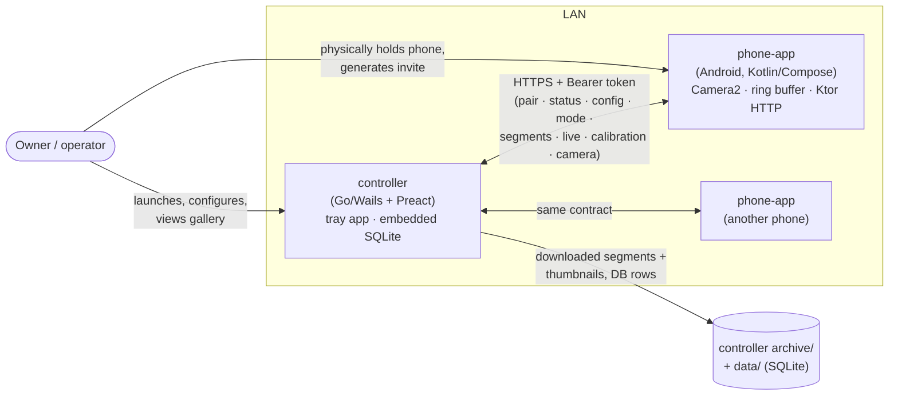
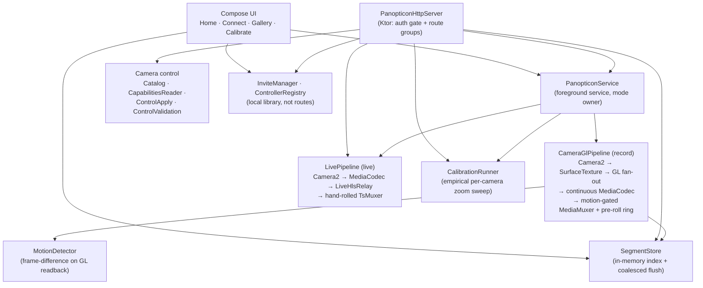
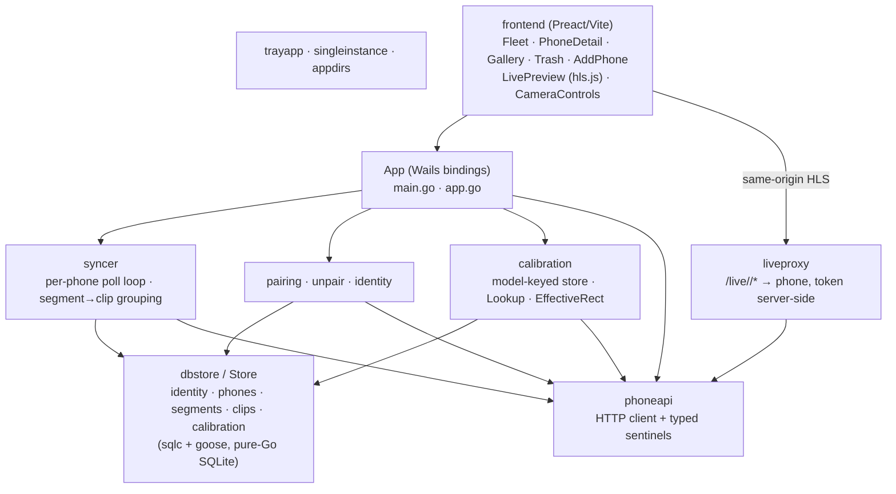
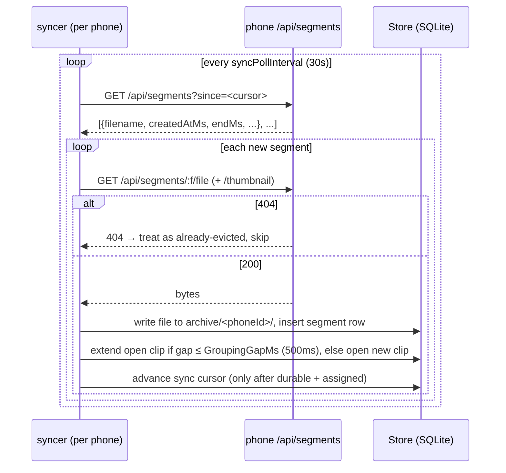

# Panopticon — architecture description

*Structured after ISO/IEC/IEEE 42010. This is the system-level view; per-subsystem detail is in
[`components/`](components/), and the reasoning behind the choices recorded here
is in [`decisions/`](decisions/).*

---

## 1. Introduction

### 1.1 Purpose and scope

Panopticon turns spare Android phones into standalone, cloud-free security cameras. A phone
records motion-triggered video to a local ring buffer; a desktop **controller** pairs with one
or more phones over the LAN, continuously syncs their footage into a local aggregate gallery,
and can view live, configure, calibrate, and pull recordings.

This document describes the architecture of the system as built: two applications
(`phone-app/`, `controller/`) plus shared build/codegen tooling (`tools/`), in one monorepo.

### 1.2 Status

Both applications exist as working, cross-verified vertical slices — pair → record → sync a
clip → view it — plus feature slices layered on since (camera control, calibration, motion-gated
recording, plain-HLS live view, the controller UX overhaul). See
[`../status/README.md`](../status/README.md) for the current build/verify status
and the remaining-work plans.

### 1.3 Definitions

| Term | Meaning |
|---|---|
| **segment** | one recorded `.mp4` file in the phone's ring buffer; the phone's only unit of footage |
| **clip** | a contiguous run of segments recorded back-to-back during one motion event; the user-facing gallery item, assembled **by the controller** on sync (the phone has no notion of it) |
| **controller** | the desktop app; pairs with phones, syncs and presents their footage |
| **mode** | the phone's top-level camera state: `record`, `standby`, or `live` |
| **calibration** | an empirical device-wide sweep of what the Camera2 API *actually* honours, versus what it declares |
| **prototype** | `../panopticon-prototype/` — an earlier, abandoned attempt on a Node/TS + Kotlin stack; mined for lessons, no code reused |

These terms are used unqualified throughout the component design descriptions in
[`components/`](components/); each of those adds only its own local terms.

### 1.4 Acronyms and abbreviations

Every component design description in [`components/`](components/) links the acronyms in its
§1.5 back to a row here. For a narrative walk-through of the Android camera / media / GL / HLS
machinery these expand to — aimed at a reader who is *not* an Android camera-stack specialist —
see [`android-media-primer.md`](android-media-primer.md).

- **ADR** — architecture decision record ([`decisions/`](decisions/))
- **SDD** — software design description (ISO/IEC/IEEE 1016)
- **API** — application programming interface; also **API level**, the Android SDK version a device runs (e.g. API 28, API 36)
- **HAL** — hardware abstraction layer (Android camera / media)
- **ART** — Android Runtime; verifies every referenced field/method when a method is first run, guard or not
- **SDK** — software development kit (here, the Android SDK)
- **HTTP / HTTPS** — Hypertext Transfer Protocol (Secure)
- **JSON** — JavaScript Object Notation
- **CORS** — cross-origin resource sharing
- **URL** — uniform resource locator
- **LAN** — local area network
- **DTO** — data transfer object (a plain wire/serialisation type)
- **UI / UX** — user interface / user experience
- **SPA** — single-page application (the controller frontend)
- **JSX** — the XML-in-JavaScript syntax Preact components use
- **CSS** — Cascading Style Sheets
- **SVG** — Scalable Vector Graphics
- **DB** — database (the controller's embedded SQLite)
- **SQL** — Structured Query Language
- **CGO** — the Go↔C foreign-function bridge (deliberately avoided)
- **OS** — operating system
- **PID** — process identifier
- **cwd** — current working directory
- **Ed25519** — the elliptic-curve signature scheme used for controller identity
- **HLS** — HTTP Live Streaming
- **LL-HLS** — Low-Latency HLS
- **TS / MPEG-TS** — MPEG transport stream (`.ts` segments)
- **PAT / PMT / PCR / PES** — MPEG-TS program association table / program map table / program clock reference / packetised elementary stream
- **DVR** — the seek-back buffer a live player retains
- **AVC** — Advanced Video Coding (H.264)
- **AU** — access unit (one coded frame's worth of bitstream)
- **PTS** — presentation timestamp
- **GL / GPU** — OpenGL ES / graphics processing unit
- **EGL** — the native platform layer between OpenGL ES and the windowing system
- **FBO** — framebuffer object (an off-screen GL render target)
- **OES** — OpenGL ES extension namespace; here the external-texture sampler a `SurfaceTexture` feeds
- **AE / AF / AWB** — auto-exposure / auto-focus / auto-white-balance (Camera2)
- **OIS** — optical image stabilization
- **ISO** — sensor sensitivity (film-speed equivalent)
- **EV** — exposure value (exposure-compensation steps)
- **RGGB** — the red/green/green/blue Bayer channel order for manual white-balance gains
- **ANR** — "Application Not Responding" (an Android main-thread stall)
- **RAM** — random-access (working) memory
- **SIGSEGV** — the segmentation-fault signal (a native memory fault)
- **QR** — Quick Response (2-D barcode)

### 1.5 References

- [`decisions/`](decisions/) — the architecture decision records.
- [`android-media-primer.md`](android-media-primer.md) — background on the Android camera /
  media / GL / HLS APIs the `phone-*` and live components assume, for a non-specialist.
- [`http-api.md`](http-api.md) — the phone HTTP contract.
- [`components/`](components/) — per-subsystem design descriptions.
- [`../status/README.md`](../status/README.md) — build/verify status and remaining-work plans.
- [`../quirks/`](../quirks/) — reproduced device / library / OS / toolchain misbehaviour.
- [`../../CONTRIBUTING.md`](../../CONTRIBUTING.md) — build, run, test.

---

## 2. Stakeholders and concerns

| Stakeholder | Concerns |
|---|---|
| **Owner / operator** (runs the fleet) | footage is captured and retained locally; no cloud, no account; a phone's identity to the controller is a public key, never an IP or location; the gallery is "always almost up to date" without having to open a window |
| **Developer / maintainer** | two disparate stacks (Android/Kotlin, Go/Wails) buildable from one entry point; device-specific Camera2/HAL behaviour is documented, not rediscovered; decisions are recorded so they aren't re-litigated |
| **The phone as a constrained host** | old/low-end hardware: one hardware encoder, weak HALs that reject multi-stream configs, limited RAM/thermal headroom; the app must not assume flagship behaviour |
| **The controller as an always-on background process** | must run without a window; must not lose footage that the phone's ring buffer will eventually evict; must survive crashes and restarts without corrupting local state |

Concern → where addressed:

- *No cloud / local-only* → §4 deployment; every component is on-LAN or on-disk.
- *Identity by public key* → [`decisions/0003-pairing-and-unpairing.md`](decisions/0003-pairing-and-unpairing.md).
- *Gallery always current* → the controller's background syncer (§5.2), independent of the UI.
- *Don't lose evictable footage* → the segment/clip/tombstone model
  ([`decisions/0006-segments-clips-and-tombstones.md`](decisions/0006-segments-clips-and-tombstones.md)).
- *Constrained encoder/HAL* → single-stream GPU fan-out recording pipeline
  ([`decisions/0004-recording-pipeline.md`](decisions/0004-recording-pipeline.md)),
  and [`../quirks/`](../quirks/).
- *One build entry point* → the root `Makefile`; see [`../../CONTRIBUTING.md`](../../CONTRIBUTING.md).

---

## 3. Context

The phone is the server; the controller is the client. Pairing is bootstrapped out of band —
the owner holds the phone, reads an invite (code + address, or a QR encoding both), and gives it
to a controller they also hold. There is no discovery protocol and no third party.

---

## 4. Deployment view

- **phone-app** — a foreground `START_STICKY` Android service (`PanopticonService`) owns the
  camera and an embedded Ktor/Netty HTTP server on port 8080. State (config, pairings, segment
  index) is on-device: `SharedPreferences` + a `clips/` directory in app storage. No outbound
  network calls; it only answers the controller.
- **controller** — a single Go binary, no bundled runtime. A system-tray presence (model:
  Syncthing/Tailscale) keeps a background sync loop running whether or not a window is open. The
  window is an OS-native embedded webview (Wails: WebView2 / WebKitGTK / WKWebView) rendering a
  Preact frontend. Local state is one embedded SQLite DB (`data/panopticon.db`, pure-Go
  `modernc.org/sqlite` driver — no CGO); synced footage lands in `archive/<phoneId>/`.
- **tools/** — build-time only: `mock-phone` (a fake phone for controller dev/tests), `dbstore`
  and `go-deps` (sqlc/goose codegen plumbing). Each is its own Go module; `go.work` ties them
  together. Not shipped.

Rationale: [`decisions/0011-controller-runtime-and-state.md`](decisions/0011-controller-runtime-and-state.md),
[`decisions/0001-repository-and-build.md`](decisions/0001-repository-and-build.md).

---

## 5. Logical / component view

### 5.1 phone-app

*The `Camera2 → SurfaceTexture → GL fan-out → MediaCodec → MediaMuxer` and
`Camera2 → MediaCodec → TsMuxer` chains below are walked through, API by API, in
[`android-media-primer.md`](android-media-primer.md) §9.*

`record`, `standby`, and `live` are mutually exclusive; `record` is sticky and must be left for
`standby` explicitly before calibration or live can take the camera
([`decisions/0010-mode-state-machine.md`](decisions/0010-mode-state-machine.md)). Component
detail: [`components/`](components/) `phone-*` files.

### 5.2 controller

The UI is a **read view over the SQLite DB**, not a live re-derivation from phone calls
([`decisions/0011-controller-runtime-and-state.md`](decisions/0011-controller-runtime-and-state.md)).
Component detail: [`components/`](components/) `controller-*` files.

### 5.3 Key interaction: sync + grouping

Cursor advancement is idempotent and crash-safe: a segment is only "done" once written,
assigned to a clip, and indexed. Detail:
[`components/controller-sync.md`](components/controller-sync.md).

---

## 6. Data view

### 6.1 phone-app

Persisted on device, no schema/migration framework:

- **`DeviceConfig`** — `deviceName`, `motionSensitivity`, `storageCapBytes`, `ringBufferMaxAgeMs`,
  `activeCameraId`, `cameraControls` (`CameraControlKeys` + `rotationDegrees` + `videoResolution`).
- **Segment index** — one JSON blob in `SharedPreferences`, held in memory by `SegmentStore` as
  the authoritative copy; `reconcile()` on launch drops entries whose file is gone and re-probes
  untracked files. (Dir/keys still literally say `clip` for historical reasons — renaming would
  orphan every recorded file for no behavioural gain.)
- **Pairings** — `ControllerRegistry`: per-controller `{controllerId, publicKey, name, kind,
  token}`. Pending invites in `InviteManager`.
- **Calibration result** — last completed run, written to disk, served from
  `GET /api/calibration/result` without a `runId`.

### 6.2 controller

One SQLite DB, goose migrations applied on every `Open()`, sqlc-generated query code:

| Table | Holds |
|---|---|
| `identity` | the controller's own Ed25519 keypair |
| `phones` | paired phones: id, name, base URL, bearer token, last-seen, sync cursor |
| `segments` | one row per synced file, each carrying a `clip_id` |
| `clips` | the user-facing gallery item: a contiguous run of segments, with the `active`/`trashed`/`purged` lifecycle and aggregate span/size/count |
| `calibration` | `manufacturer+model` → last result JSON + source phone + timestamp (a **shared** resource, not per-phone) |

The `clips` lifecycle and why a purged row keeps its tombstone:
[`decisions/0006-segments-clips-and-tombstones.md`](decisions/0006-segments-clips-and-tombstones.md).
Calibration keyed by model:
[`decisions/0009-calibration-model.md`](decisions/0009-calibration-model.md).

---

## 7. Cross-cutting

- **Auth** — pairing exchanges a controller public key for a per-controller bearer token (not a
  shared secret), so any one controller can be revoked without touching the others. Every route
  but `POST /api/pair` requires `Authorization: Bearer <token>`. No permission tiers.
  ([`decisions/0002-http-api-surface-and-auth.md`](decisions/0002-http-api-surface-and-auth.md).)
- **The HTTP contract** — [`http-api.md`](http-api.md) is authoritative for wire
  shapes and status codes; both sides implement against it and `tools/mock-phone` fakes it.
- **Device quirks** — [`../quirks/`](../quirks/) records reproduced Camera2 / MediaCodec / HAL /
  hls.js / Windows-toolchain misbehaviour and the workarounds. Read it before "cleaning up"
  odd-looking code.
- **Visual language** — the dark/teal theme shared by both UIs is an inherited **placeholder**,
  not a settled decision; a visual-language pass is deferred
  ([`../status/visual-language-pass.md`](../status/visual-language-pass.md)).

---

## 8. Architecture decisions

The thematic decision records in [`decisions/`](decisions/) are the rationale of record:

| ADR | Covers |
|---|---|
| [0001](decisions/0001-repository-and-build.md) | Monorepo + linear history, `tools/` as separate modules + `go.work`, sqlc/goose, generated-code layout, private tool isolation, `Makefile` entry point |
| [0002](decisions/0002-http-api-surface-and-auth.md) | Per-controller bearer token, no permission tiers, no pairing confirmation, which actions are routes vs local library functions |
| [0003](decisions/0003-pairing-and-unpairing.md) | Phone-only invite generation, address+code (QR carries both), Unpair vs Force unpair, public-key-only identity |
| [0004](decisions/0004-recording-pipeline.md) | Single camera stream + GPU fan-out, continuous encoder + motion-gated muxer, pre-roll ring, gapless rotation, no audio |
| [0005](decisions/0005-motion-detection.md) | Frame-difference only, un-tuned thresholds, motion kept out of the live API |
| [0006](decisions/0006-segments-clips-and-tombstones.md) | Phone speaks segments; controller assembles clips; three-state lifecycle; purge-keeps-tombstone; no favorites |
| [0007](decisions/0007-live-preview-plain-hls.md) | Plain HLS not LL-HLS, hand-rolled TS muxer, vendored hls.js, RECORD/LIVE exclusive, arming-retry contract |
| [0008](decisions/0008-camera-control-and-multi-camera.md) | Multi-camera first-class, logical+physical ids, `CameraControlKeys`, validate-then-apply, control state spans pipelines |
| [0009](decisions/0009-calibration-model.md) | Device-wide empirical sweep, persisted on phone, controller-side store keyed by `manufacturer+model` |
| [0010](decisions/0010-mode-state-machine.md) | `record` (sticky) / `standby` / `live`; transitions and their error codes |
| [0011](decisions/0011-controller-runtime-and-state.md) | Tray app not window-first, single binary + embedded webview, SQLite as source of truth |
| [0012](decisions/0012-ux-shape.md) | Fresh Compose start, phone Preview-screen interaction patterns, controller master-detail screens, placeholder theme |
